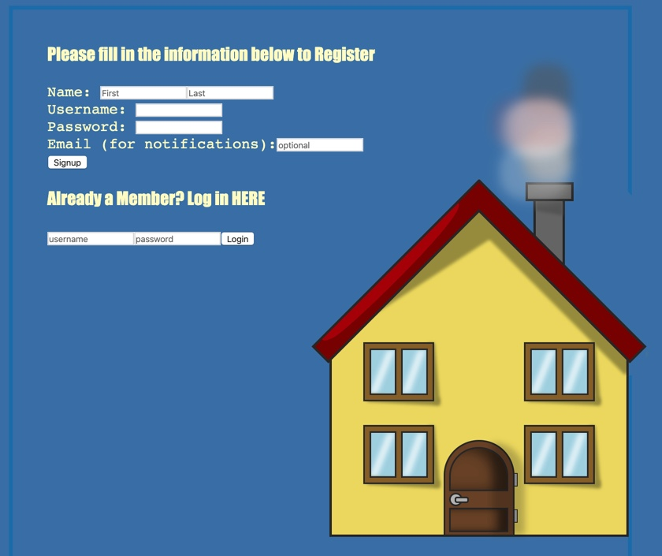

# tool-shed

Objective - create an app that neighbors can log on to and list the tools that they have that their neighbors can borrow.  Their neighborhood can look at a neighborhood created for them that lists all the tools available for them to borrow.

[Here is the published project.](http://toolshed.surge.sh/)

[Here is the frontend repository.](https://github.com/xjeffss/toolshed-frontend/tree/main/toolshed-frontend)

[Here is the backend repository.](https://github.com/xjeffss/toolshed-backend)

## User stories
* A neighbor doesn't want to buy a tool to use once every three years
* A neighbor has bought a tool that he has only used once in 3 years and would not mind if someone borrowed it
* A neighbor does not want to make a huge purchase of a tool that he only needs on time
* A neighbor wants to borrow tools from his neighbors but needs to know what tools are available and close to lend

## Challenges
* Getting the join tables to connect and display joined data
* Floating CSS styling
* Locating and passing data from the DB between pages

## Summary
This website was the result of a question I asked to people around me, "What website do you wish existed?"  The most intriguing answer was about a website where neighbors could display to their neighbors what tools they had that were available to them for loan. This drove the MVP and MVP ++ requirements below.

## MVP - 
* Create User
* Login 
* Create Neighborhood with passcode
* Add Tools to your use profile that register to neighborhoods of which you are member
* Display all users and tools that are members of a neighborhood

## MVP ++
* Log to whom the tool was lent and confirm when it has been returned
* Be able to list only certain categories of tools to each neighborhood
* Be able to post requests on your Neighborhood page that email neighbors when someone posts

